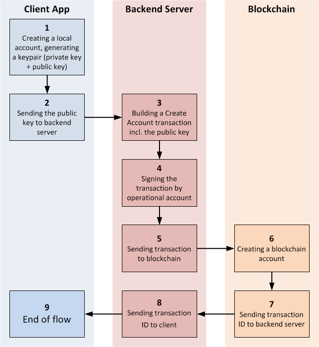
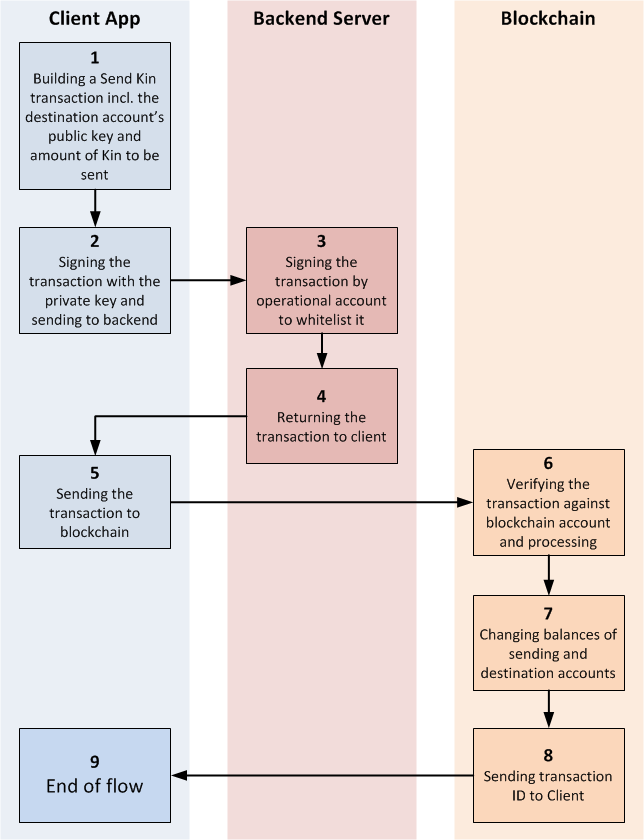
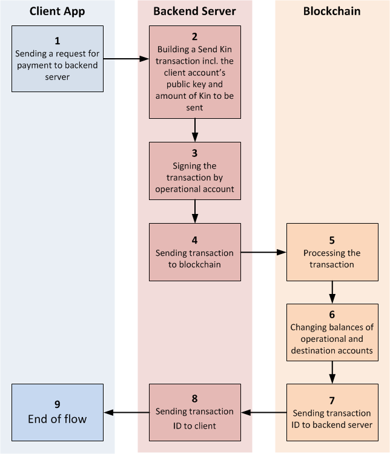

This section describes how the whole system works. It also includes the initial setup the developer has to carry out in order to create a fully functioning Kin-enabled app.
## Initial Setup
The initial setup of a Kin app to be performed by the developer comprises the following steps:
1. Registration with Kin and obtaining an appID 
2. Implementing the Client Kin SDK
3. Implementing the Backend Server Kin SDK
4. Creating client (local) accounts for existing users 
5. Creating a blockchain account for each user 
### Registration with Kin and Obtaining an appID
The developer registers with Kin (see https://kinchallenge.devpost.com/) and uses the Keypair Generator service for generating a keypair (see https://laboratory.kin.org). He then sends the public key of the keypair to Kin. 

Kin sends the developer an appID. Also, using the public key as an identifier, Kin creates a blockchain account for the developer, linked to the same appID. Later, after the developer implements Kin SDKs, this blockchain account will become his [operational account](https://docs.kin.org/terms-and-concepts#account-operational). 

The account is [whitelisted](https://docs.kin.org/terms-and-concepts#whitelisting).
### Implementing the Client Kin SDK
This step provides the developer’s app with access to the Kin infrastructure. 

Kin offers three client SDKs for the developer to choose from: Kin SDK for Android, Kin SDK for iOS and Kin SDK for Unity. Each SDK provides classes and methods for creating and managing Kin accounts. The developer has to integrate one of them in his application code. 

Each Client SDK has two preconfigured environments to select from: Test and Production. Using a customized environment is also possible. For the purpose of this overview, we describe only the Production environment.
### Implementing the Backend Server Kin SDK
In production, this server connects the client app with the Kin blockchain and enables processing Kin transactions. 

Kin offers two backend SDKs for the developer to choose from:  Kin SDK for Python and the Kin SDK for Node.js.  The developer has to integrate one of them in his backend code. 

Each backend server SDK has two preconfigured environments to select from: Test and Production. Using a customized environment is also possible. For the purpose of this overview, we describe only the Production environment.

When initializing the backend server SDK, the developer uses the [private key](https://docs.kin.org/terms-and-concepts#private-key-private-seed) of the blockchain account created at the beginning of the setup. Then the account can be used as operational account (for whitelisting transactions, creating new accounts and sending payments to users).
### Creating Client (Local) Accounts for Existing Users 
Once the Client Kin SDK is implemented, the developer creates a client (local) account for each user of his app. These accounts reside on the users’ devices. When such an account is created, a keypair is generated. Its private key is stored securely on the user’s device, and the public key is used for creating a corresponding account on the blockchain (see the next step).
### Creating a Blockchain Account for Each User
For accessing the blockchain and performing Kin transactions, each client account has to have a corresponding blockchain account. This is done by building a Create Account transaction that contains the public key of the client account and sending it to the developer’s operational blockchain account (see section Creating an Account). The operational account signs the transaction and creates a blockchain account. 
## Operation
### Core Functionalities of a Kin App
There are two main functionalities that the developer has to implement for operating a Kin-enabled app: 
* Creating accounts
* Sending Kin (between users or between app and users) 
The Kin SDK provides many other functionalities but the two listed above are both necessary and sufficient for operation. 
### Accounts
Accounts (sometimes referred to as wallets) are objects that allow their owners to store and manage funds (Kin) and to perform various Kin transactions. There are two basic types of Kin accounts - [local (client) account](https://docs.kin.org/terms-and-concepts#account-local-client) and [blockchain account](https://docs.kin.org/terms-and-concepts#account-blockchain). Each fully functioning local account has a corresponding blockchain account.
#### How Accounts Work
User accounts work in pairs. Every user has a local account created on the client app (i.e., on the user's device) and a corresponding blockchain account. When created, the local account receives a unique identifier – a keypair (private key + public key). 

The public key of the keypair is also a unique identifier and the address of the corresponding account on the blockchain. 

The roles of the above accounts are as follows:
* The local account enables its owner to build transactions, to sign them and to send them to the blockchain to be processed (after authentication).
* The blockchain account authenticates transactions sent from the local account (see more on that in section Transaction Security) before they can be processed by the blockchain. 
In addition, the blockchain account holds the Kin balance and has access to the account data stored in the blockchain database (e.g., transaction log).

There are two other types of Kin accounts, intended for technical purposes:
* Operational account 
This account signs Create Account transactions, whitelist Send Kin transactions and stores Kin for paying rewards to users. Just like user accounts, this account has its own keypair, stored on the developer’s backend server.
* Cold-storage account
This account is used for storing large amounts of Kin offline, receiving KRE rewards and replenishing the operational account. 

Just like user accounts, each of these accounts has its own keypair, stored on the developer’s backend server.
### Creating an Account
User accounts are created in pairs and the process requires both the client and server SDKs. 
1. The first step of the process is to create an account locally on a client device. This action generates a public/private keypair. At this point, the newly created account is not connected to the blockchain yet. 
2. The next step is to create a corresponding account on the Kin blockchain. To do that, the developer needs an account that already exists on the blockchain to sign the transaction and create a new account. The developer’s operational account on the backend server can be used for this purpose. 

The local account sends the public key of its keypair to the backend server. The server builds a Create Account transaction, has it signed by the operational account and sends it to the blockchain. The blockchain creates a new account with the public key as its identifier and address.
A successful account creation results in a transaction ID, which is returned to the backend server for verification.

   **Account Creation Flow**

   
### Transactions
Blockchain transactions can contain multiple independent operations (up to 100). However, the most common transaction types are payment transactions and create account transactions, and each of them contains only a single operation.  

#### Transaction Security
The security of Kin transactions is protected by asymmetric cryptography used for creation of keypairs. There is a one-to-one correspondence between the private key and the public key created by means of a cryptographic algorithm. This correspondence is asymmetrical, that is, the public key can be easily derived from the private key, but the private key cannot be obtained from the public key. This property of a keypair is used for securing Kin transactions on the blockchain.

Each transaction is signed with the private key of the account. The combination of the signature and the public key held by the blockchain account authenticates the transaction and indicates to the blockchain from which account to deduct Kin. 

The private keys of users’ accounts are encrypted and securely stored on their devices.
#### Transaction Fees
By default, all transactions on the Kin blockchain are charged a fee. However, each approved Kin app has its operational account exempted from transaction fees (“whitelisted”) by Kin, which makes the account’s transactions feeless. Although user accounts created by the app will not be whitelisted, their transactions can be whitelisted by the operational account as well.
#### How Transactions Work
##### Spending Transactions 
These are transactions of either sending Kin to another user (P2P) or sending Kin to the app. Their flow is as follows:
1. The client account builds a Send Kin transaction, in which it indicates the destination account address. In case of sending Kin to the app, the destination account is the developer’s operational account.
2. The client account signs the transaction with its private key (without disclosing it) and sends the transaction to the backend server.
3. The operational account signs the transaction to whitelist it. 
4. The backend server returns the transaction to the client account.
5. The client account sends the transaction to the blockchain. 
6. The blockchain verifies the transaction against the corresponding blockchain account and processes it. 
7. The specified amount of Kin is deducted from the sending account’s balance and added to the destination account’s balance.
8. A transaction ID is returned to the backend server.

Note that the backend Kin SDK handles all interactions with the blockchain and they are completely transparent to the developer.

   **Spending Transaction Flow** 

   

##### Earning Transactions (Paying Rewards) 
Sometimes a user is rewarded by the app for some activity that the app tries to encourage. In that case, a payment transaction is sent from the developer’s operational account to a specified user account.
The flow of an earning transaction is as follows:
1. The client account sends a request for a payment to the backend server.
2. The backend server builds a Send Kin transaction, in which it indicates the destination account address and specifies the amount of Kin.
3. The operational account signs the transaction with its private key 
4. The backend server sends the transaction to the blockchain. 
5. The blockchain processes the transaction. 
6. The specified amount of Kin is deducted from the operational account’s balance and added to the destination account’s balance.
7. A transaction ID is returned to the backend server.

   **Earning Transaction Flow** 

   
